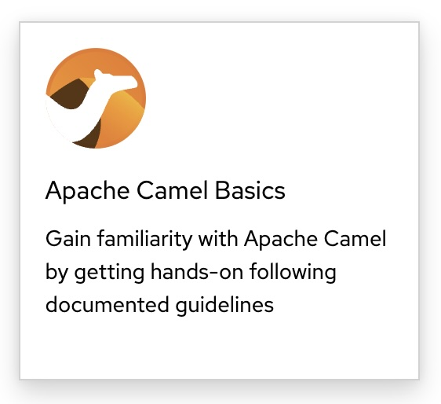

# Apache Camel JBang tutorials

This repository contains hands-on tutorials to get you started with **Camel JBang**—the CLI that lets you run, iterate, and test Apache Camel applications without complex setup. The labs use small, playful scenarios (tennis rally and motor racing) so you can learn core commands and patterns by doing.

You can run these tutorials in three ways. Pick your path:

---

## Index – how to run these tutorials

| Option | Description |
|--------|-------------|
| **[1. Run on your local machine](#run-on-your-local-machine)** | Click a lab in the table below and follow the walkthrough on your machine. |
| **[2. Red Hat Developer Sandbox](#red-hat-developer-sandbox)** | Best experience: run the labs in Dev Spaces (free, open to anyone). |
| **[3. Red Hat Apache Camel workshop](#red-hat-apache-camel-workshop)** | Contact Red Hat to run a full Apache Camel workshop session. |

---

## Run on your local machine

Choose a lab and follow the GitHub-friendly instructions. Each link opens the walkthrough you can run on your own machine.

| | |
|:---:|:---:|
| [**Tennis Rally**](docs/labs/01-tennis/walkthrough-github.adoc)<br/>*Camel JBang – first steps with a tennis game*<br/>[](docs/labs/01-tennis/walkthrough-github.adoc) | [**Full Throttle**](docs/labs/02-racing/walkthrough-github.adoc)<br/>*Camel JBang – motor racing simulation*<br/>[](docs/labs/02-racing/walkthrough-github.adoc) |

For a **better reading experience**, you can run the documentation locally with a container. From the repository root, use Podman:

```bash
LABS=camel-workshop-docs-labs; \
podman run --rm -it -p 5001:5001 --name solex \
-v $PWD/docs/labs:/opt/$LABS \
-e NODE_ENV=production \
-e THREESCALE_WILDCARD_DOMAIN=apps.your-domain.com \
-e OPENSHIFT_VERSION=4 \
-e WALKTHROUGH_LOCATIONS="/opt/$LABS" \
-e DATABASE_LOCATION="/opt/$LABS" \
quay.io/redhatintegration/tutorial-web-app:latest
```

Then open `http://localhost:5001` in your browser.

---

## Red Hat Developer Sandbox

Run these labs in **Dev Spaces** on [Red Hat Developer Sandbox](https://developers.redhat.com/developer-sandbox), free and open to everyone. For more information, see [OpenShift Dev Spaces](https://developers.redhat.com/products/openshift-dev-spaces).

**Steps to run in Dev Spaces:**

1. **Open [Dev Spaces](https://workspaces.openshift.com/)** — (Click it to get started!).
2. **Register** — Sign up to access (open and free to everyone).
3. **Start the labs** — Find the samples (tiles) and click **"Apache Camel Basics"**:

    
---

## Red Hat Apache Camel workshop

For teams or events, you can request a full Apache Camel workshop delivered by Red Hat. This option includes guided sessions and support. Contact Red Hat to schedule a workshop.
