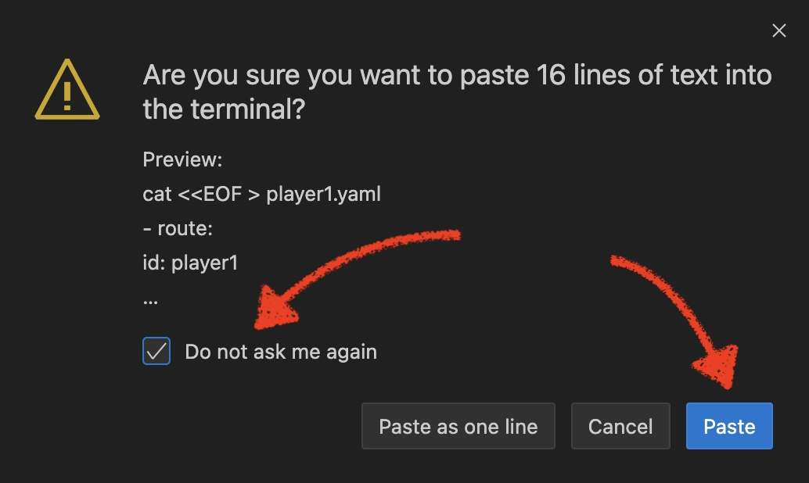
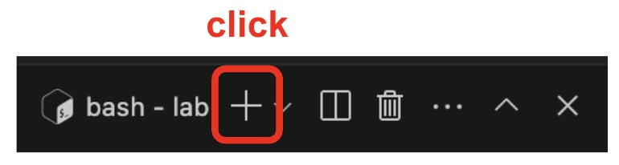
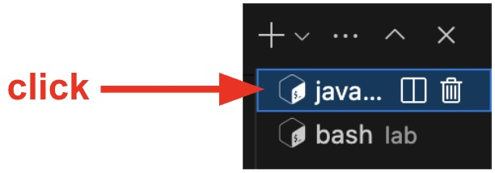
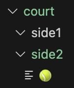

:walkthrough: Camel JBang first steps
:user-password: openshift
:namespace: {user-username}-devspaces

// URLs
:codeready-url: http://devspaces.{openshift-app-host}/

:experimental:

// WORKS
:style-kbd: kbd { \
  color: black; \
  background-color: lightgrey; \
  border: 1px solid black; \
  box-shadow: 0px 1px black; \
  font-size: .85em; \
  line-height: .85em; \
  display: inline-block; \
  font-weight: 600; \
  letter-spacing: .05em; \
  padding: 3px 5px; \
  white-space: nowrap; \
  border-radius:5px; \
} \

:cp-btn: pass:[<svg fill="currentColor" height="1em" width="1em" viewBox="0 0 448 512" aria-hidden="true" role="img" style="vertical-align: -0.125em;"> <path d="M320 448v40c0 13.255-10.745 24-24 24H24c-13.255 0-24-10.745-24-24V120c0-13.255 10.745-24 24-24h72v296c0 30.879 25.121 56 56 56h168zm0-344V0H152c-13.255 0-24 10.745-24 24v368c0 13.255 10.745 24 24 24h272c13.255 0 24-10.745 24-24V128H344c-13.2 0-24-10.8-24-24zm120.971-31.029L375.029 7.029A24 24 0 0 0 358.059 0H352v96h96v-6.059a24 24 0 0 0-7.029-16.97z"></path></svg>]

:style-summary: summary {cursor: pointer; list-style: none;}
:style-triangle: .triangle {margin-right: .5em;} summary:hover .sumtext {text-decoration: underline;}
:style-details:  .triangle::before {content: "▶";} details[open] .triangle::before {content: "▼";}
:style-open-close: {style-summary}{style-triangle}{style-details} 

:style-preview: pre {background-color: #272822; color: white; padding: 5px 15px; font-size: 15px}
:style-indent: .indent2 {padding-left: 2rem;}
:style-all: pass:a[]

:url-docserver: https://docserver-webapp.{openshift-app-host}
//:url-docserver: http://0.0.0.0:8080

:docserver-status: pass:a[ response.text()) \
        .then(data => this.parentElement.innerHTML = 'Status: 

&nbsp;
') \
        .catch(error => this.parentElement.innerHTML = 'Status: 

&nbsp;
') \
      ">]

:freplace: pass:[function replaceTokens(templateString, values) { \
    const valueArray = values.split(',').map(val => val.trim()); \
    let result = templateString; \
    let replaceIndex = 0; \
    while (result.includes('REPLACE') && replaceIndex < valueArray.length) { \
        result = result.replace('REPLACE', valueArray[replaceIndex]); \
        replaceIndex++; \
    } \
    return result; \
}]

:fdocserver: pass:a[function docserver(target,template,params) { \
    {freplace} \
    fetch('{url-docserver}/roomid?user='+params) \
        .then(response => response.text()) \
        .then(data => {target.firstChild.data=replaceTokens(text, data);}) \
        .catch(error => room = 'Error fetching data: ' + error.message); \
}]

:fcopy: pass:a[function copy(el) { \
  el.previousElementSibling.select(); \
  text = el.previousElementSibling.textContent; \
  console.log(text); \
  navigator.clipboard.writeText(text + '\n') \
        .then(response => console.log('Text with carriage return copied to clipboard!')) \
        .catch(err => console.error('Failed to copy: ', err)); \
}]

:copypaste: pass:a[ \

 \
  <textarea readonly style="field-sizing: content;border: none; background-color: #f0f0f0; width: 100%; resize: none; font-size:14px; font-family: monospace;padding: 5px 15px" rows="1">function example() { \
  console.log("Hello {replace-with-previous}!"); \
  return true; \
}</textarea> \
  <button class="mytooltip" onclick="{fcopy} copy(this);" style="border: none; background-color: white; padding: 5px 15px; border-bottom: 1px solid transparent; transition: border-bottom-color 0.2s;"> \
    <svg fill="currentColor" height="1em" width="1em" viewBox="0 0 448 512" aria-hidden="true" role="img" style="vertical-align: -0.125em;"> \
      <path d="M320 448v40c0 13.255-10.745 24-24 24H24c-13.255 0-24-10.745-24-24V120c0-13.255 10.745-24 24-24h72v296c0 30.879 25.121 56 56 56h168zm0-344V0H152c-13.255 0-24 10.745-24 24v368c0 13.255 10.745 24 24 24h272c13.255 0 24-10.745 24-24V128H344c-13.2 0-24-10.8-24-24zm120.971-31.029L375.029 7.029A24 24 0 0 0 358.059 0H352v96h96v-6.059a24 24 0 0 0-7.029-16.97z"></path> \
    </svg> \
    Copy to clipboard \
  </button> \
   \

 \
 \
]

:fcopy-no-new-line: pass:a[function copy(el) { \
  el.previousElementSibling.select(); \
  text = el.previousElementSibling.textContent; \
  console.log(text); \
  navigator.clipboard.writeText(text) \
        .then(response => console.log('Text with carriage return copied to clipboard!')) \
        .catch(err => console.error('Failed to copy: ', err)); \
}]

:copy-open: pass:a[ \

 \
  <textarea readonly style="field-sizing: content;border: none; background-color: #f0f0f0; width: 100%; resize: none; font-size:14px; font-family: monospace;padding: 5px 15px" rows="1">]

:copy-close: pass:a[</textarea> \
  <button class="mytooltip" onclick="{fcopy-no-new-line} copy(this);" style="border: none; background-color: white; padding: 5px 15px; border-bottom: 1px solid transparent; transition: border-bottom-color 0.2s;"> \
    <svg fill="currentColor" height="1em" width="1em" viewBox="0 0 448 512" aria-hidden="true" role="img" style="vertical-align: -0.125em;"> \
      <path d="M320 448v40c0 13.255-10.745 24-24 24H24c-13.255 0-24-10.745-24-24V120c0-13.255 10.745-24 24-24h72v296c0 30.879 25.121 56 56 56h168zm0-344V0H152c-13.255 0-24 10.745-24 24v368c0 13.255 10.745 24 24 24h272c13.255 0 24-10.745 24-24V128H344c-13.2 0-24-10.8-24-24zm120.971-31.029L375.029 7.029A24 24 0 0 0 358.059 0H352v96h96v-6.059a24 24 0 0 0-7.029-16.97z"></path> \
    </svg> \
    Copy to clipboard \
  </button> \
   \

 \
]

:snippet: pass:a[ \

 \

 \
 \
]

ifdef::env-github[]
endif::[]

[id='tennis-rally']
= Camel JBang - Tennis Rally

Familiarise yourself with the prototyping tool helping you to run, iterate and test your Camel applications. 

_Camel JBang_ is a command-line interface (CLI) that accelerates prototyping by letting developers quickly create, validate, and tweak flows without complex setups, making it perfect for rapid experimentation.

image::images/camel-jbang.png[align="left", width=40%]

{empty} +

This chapter is recommended to understand how _Camel JBang_ helps you work fast with _Apache Camel_

{empty} +

// [type=walkthroughResource,serviceName=openshift]
// .Doc System
// ****
// [subs=attributes]
// ++++
// 
{docserver-status}

// ++++
// ****

[time=15]
[id='intro-camel-jbang']
== Camel JBang at play
{style-all}

// [type=taskResource]
// .Red Hat OpenShift Dev Spaces
// ****
// * link:{codeready-url}[Console, window="_blank", , id="resources-codeready-url"]
// ****
// [type=taskResource]
// .Red Hat OpenShift Developer Console
// ****
// * link:{openshift-host}/topology/ns/{namespace}[Topology View, window="_blank"]
// ****
// [type=taskResource]
// .Credentials
// ****
// * *username:* `{user-username}`
// //* *password:* `{user-password}`
// ****
// [type=walkthroughResource,serviceName=openshift]

When a developers are tasked to deliver a solution, prototyping and experimentation are crucial to finding the best path forward, especially when adopting new, unfamiliar tools and techniques.

_Camel JBang_ is one of those key prototyping tools.

image::images/camel-jbang.png[align="left", width=40%]

{empty} +

This chapter is an introductory taste of _Camel JBang_ showing you a basic group of commands. Hopefully you'll get to see how much you can sharpen your axe when making a good use of _Camel JBang_. 

{empty} +

=== Open a terminal

Whether you're workking in your local machine or from Dev Spaces, you'll need to open a terminal. If you're working in your local machine we recommend using VS Code as the examples below are based on this editor, but you can use any other terminal you prefer.

Open a terminal, create a lab directory and change into it from where you'll work.

Click the {cp-btn} button (Copy to clipboard), and paste in your terminal:

--
{copypaste}
----
mkdir lab
cd lab
----
--

When created the first time, your `lab` directory is empty:

--
[.indent2]
📁 workshop +
&nbsp;&nbsp;📁 *lab* +
pass:[<mark style="padding-left: 1rem; background-color: white; color: grey"></mark>] [empty]
--

{empty}

The picture below shows the terminal in VS Code.

image::images/crw-terminal.png[align="left", width=100%]

{blank}

The instructions that follow will prompt you to execute commands. +
Run them from your terminal.

{empty} +

=== Playing a game with Camel JBang

They say playing is a great way to learn, so let's play for a bit. While you're at it you'll discover a few tricks _Camel JBang_ has in the bag.

NOTE: Later, we'll get serious when diving into the core of the workshop.

{empty} +

Pretend we're about to organise a tennis tournament.
Let us introduce to you **player1**:

Click the {cp-btn} button (Copy to clipboard), and paste in your terminal to create the `player1.yaml` file.

[NOTE]
====
You'll be asked to confirm the paste action, tick _"✓ Do not ask me again"_ and click `Paste`.

====

--
{copypaste}
----
cat <<EOF > player1.yaml
- route:
    id: player1
    from:
      uri: file:court/side1
      parameters:
        delete: true
      steps:
        - log:
            message: (ping)⋅⋅⋅━━━► 🥎
        - delay:
            constant: "{{pace:3000}}"
        - to:
            uri: file:court/side2
EOF
----
--

NOTE: `player1` one plays on one side of the court and hits every ball that comes his way. +
When hitting the ball, it crosses the court (at a given pace) to the other side.

Run this command to get `player1` on the court, ready to play:

--
{copypaste}
----
camel run player1.yaml
----
--

NOTE: Observe the simplicty of it all, no more than one player in the game, no dependency descriptors, no additional files needed to run the show. _Camel JBang_ figures all out, it reads `player1` and provides all that is needed to the run the game.

In your terminal you'll see `player1` ready:

++++
<pre style="line-height: 1;white-space: pre-wrap">2025-10-26 12:40:32.210 INFO 2243 --- [           main] e.camel.impl.engine.AbstractCamelContext : Apache Camel 4.15.0 (player1) started in 242ms ...</pre>
++++

{blank}

Also, watching closely your folder structure, you'll see on which side `player1` stands waiting for balls:

pass:[
<code style="background-color: black; color: lightgrey"> ❯ lab ❯ court/side1 </code>
]

{empty} +

=== Throw a ball

`player1` is ready. Give him a 🥎.

From the terminal's top right corner, click `+` to open a second terminal, as shown below:

{blank}

From the new terminal, use _Camel JBang_ to hand a ball to `player1`:

TIP: The `send` command is very helpful to test the game, you can throw balls to players and see what happens.

--
{copypaste}
----
camel cmd send player1 --header CamelFileName=🥎
----
--

Get back to the first terminal where `player1` is running:

{blank}

Inspect the terminal's output, you should see `player1` hitting the ball to the other side of the court:

++++
<pre style="line-height: 1;white-space: pre-wrap">2025-10-26 12:50:12.951 INFO 2243 --- [e://court/side1] player1.yaml:8           : (ping)⋅⋅⋅━━━► 🥎</pre>
++++

{empty} +

Have a look to the court. You should see the ball resting on the other side:

NOTE: The downside of playing tennis with a single player is that balls end up motionless on the other side of the court.

{empty} +

Before we continue, give `player1` some rest. +
Stop the action with kbd:[Ctrl+C].

{empty} +

=== The ball boy

We introduce to you the ball boy, he will ensure the court is always tidy.

Click the {cp-btn} button (Copy to clipboard), and paste in your terminal to create the `the-ballboy.yaml` file.
--
{copypaste}
----
cat <<EOF > the-ballboy.yaml
- route:
    id: ballboy
    from:
      uri: timer:check-court
      steps:
        - filter:
            groovy:
              expression: >-
                def court = ['court/side1/🥎', 'court/side2/🥎'];
                def file = court.find { new File(it).exists() }?.with { new File(it) };

                if (file?.exists() && (System.currentTimeMillis() - file.lastModified()) > {{wait:6000}} )
                  return file.delete();
                else
                  return false;
            steps:
              - log:
                  message: "🥎 cleared, court ready."
EOF
----
--

NOTE: In _Camel_, certain tasks require agility. Notice the ballboy making use of _Groovy_ to look at both sides of the court, and retrieve any ball sitting on the court for too long (6 seconds).

When you see everyone ready, use the command below to restart:

--
{copypaste}
----
camel run *
----
--

[NOTE]
====
_Camel JBang_ makes things easy:

* Use the `*` wildcard when you have multiple individuals on court. +
* The wildcard also picks up property files where you can configure a different game behaviour. +
Here's a file (optional example) `game.properties` you could use:
+
++++
<pre style="line-height: 1;white-space: pre-wrap"># Ball pace (millis) when players hit. Lower value is faster.
pace=3000

# Ballboy waits (millis) before picking up the ball.
wait=6000</pre>
++++
====

Inspect the terminal logs, you should see the ball boy already at work:

++++
<pre style="line-height: 1;white-space: pre-wrap">2025-10-26 18:23:53.558 INFO 20299 --- [r://check-court] the-ballboy.yaml:17           : 🥎 cleared, court ready.</pre>
++++

{blank}

Look also at the court. You'll notice the ball has been cleared:

image::images/court-clear.jpg[align="left", width=8%]

{empty} +

Let `player1` practice a bit more. +
When done, press kbd:[Ctrl+C] to give him some rest.

{empty} +

=== Set up the tournament

Ok, practice is over, let's organise a real game.

For a proper game to take place, you need more than just one player. +
We introduce to you `player2`:

Click the {cp-btn} button (Copy to clipboard), and paste in your terminal to create the `player2.yaml` file.
--
{copypaste}
----
cat <<EOF > player2.yaml
- route:
    id: player2
    from:
      uri: file:court/side2
      parameters:
        delete: true
      steps:
        - log:
            message: "      🥎 ◄━━━⋅⋅⋅(pong)"
        - delay:
            constant: "{{pace:3000}}"
        - to:
            uri: file:court/side1
EOF
----
--

NOTE: These players really train for doing just one thing.

Because this is a prestigious tournament, there's a protocol to follow:

{empty} +

. Let spectators sit confortably while players and staff wait in the locker rooms. +
Press kbd:[Ctrl+C] (if you didn't already) to follow on with preparations.
+
{empty} +
+
. Let the ball boy go on court first to get ready:
+
--
{copypaste}
----
camel run the-ballboy.yaml --background
----
--
+
NOTE: The flag `--background` indicates _Camel JBang_ to run the process detached.
+
{empty} +
+
. Present the players to the public and let them jump on court:
+
--
{copypaste}
----
camel run player1.yaml --background --dev
----
--
+
--
{copypaste}
----
camel run player2.yaml --background --dev
----
--
+
NOTE: The flag `--dev` indicates _Camel JBang_ to do live code reloads (new racket for example).
+
{empty} +
+
. Before the game starts, check everyone is ready:
+
--
{copypaste}
----
camel ps
----
--
+
NOTE: The `ps` command is handy to check who's playing and who's not, who's ready and who's not, and who's busy and who's not.
+
{empty} +
+
. Join the crowd and enjoy watching the game:
+
--
{copypaste}
----
camel log
----
--
+
[NOTE]
====
The `log` command aggregates all the action on court so that you're aware of all that's happening.

TIP: You can also focus on one single player, or even the ball boy if curious of what the job entails. +
For example to focus on player 1, you would run `camel log player1`.
====
+
{empty} +

Ok, the ball boy is ready, the players are ready, and the public is anxious waiting to see the game start.

{empty} +

=== Let the game begin

`player1` starts serving, hand him a 🥎

--
{copypaste}
----
camel cmd send player1 --header CamelFileName=🥎
----
--

Inspect your terminal output, you should see both players hitting the ball hard:

++++
<pre style="line-height: 1;white-space: pre-wrap;">player1    | 2025-10-26 19:01:36.006 INFO 22363 --- [e://court/side1] player1.yaml:8           : (ping)⋅⋅⋅━━━► 🥎
player2    | 2025-10-26 19:01:39.106 INFO 22578 --- [e://court/side2] player2.yaml:8           :       🥎 ◄━━━⋅⋅⋅(pong)
player1    | 2025-10-26 19:01:42.509 INFO 22363 --- [e://court/side1] player1.yaml:8           : (ping)⋅⋅⋅━━━► 🥎
player2    | 2025-10-26 19:01:45.610 INFO 22578 --- [e://court/side2] player2.yaml:8           :       🥎 ◄━━━⋅⋅⋅(pong)
...
</pre>
++++

{blank}

It's a long rally !

Also, see the ball on the court going back and forth:

image::images/court-rally.jpg[align="left", width=18%]

{empty} +

But `player1` feels the laces of his shoe are loose and has to stop to tie them up. +
Run the command:

--
{copypaste}
----
camel cmd stop-route --id player1
----
--

Because `player1` stopped hitting the ball, spectators will see `player2` hitting one last time, `player1` tying up his shoe laces, and the ball boy retrieving the ball:

++++
<pre style="line-height: 1;white-space: pre-wrap;">player2    | 2025-10-26 19:32:24.401 INFO 22578 --- [e://court/side2] player2.yaml:8               :       🥎 ◄━━━⋅⋅⋅(pong)
player1    | 2025-10-26 19:32:25.327 INFO 22363 --- [calCliConnector] .engine.AbstractCamelContext : Stopped player1 (file://court/side1)
the-ballboy| 2025-10-26 19:32:42.610 INFO 22140 --- [r://check-court] the-ballboy.yaml:17          : 🥎 cleared, court ready.
</pre>
++++

{empty} + 

==== Game statistics

It's a good moment to look at the game statistics. +
Get the stats with:

--
{copypaste}
----
camel get route
----
--

Stats will reveal who's hitting faster (and other measurements as well):

NOTE: Observe `player1` has stopped playing for a moment, but is still very much part of the game.

----
  PID   NAME         ID       FROM                            REMOTE  STATUS    AGE   COVER  MSG/S  TOTAL  FAIL  INFLIGHT  MEAN  MIN   MAX   LAST  DELTA  SINCE-LAST        
 22140  the-ballboy  ballboy  timer://check-court                     Started   6m3s    2/2   1.00    363     0         0     2     0   841     0      0            0s/0s/- 
 22363  player1      player1  file://court/side1?delete=true    x     Stopped           3/3   0.00     25     2         0  2001  2001  2007  2001      0  1m31s/1m29s/1m41s 
 22578  player2      player2  file://court/side2?delete=true    x     Started  5m21s    3/3   0.00     23     0         0  2001  2001  2012  2001      0      1m29s/1m27s/- 
----

{empty} + 

==== The game resumes

It seems `player1` sorted out the shoe laces problem and is ready to play again. +
Get the player in position again with:

--
{copypaste}
----
camel cmd start-route --id player1
----
--

It's `player2` 's turn to serve, hand him a 🥎

--
{copypaste}
----
camel cmd send player2 --header CamelFileName=🥎
----
--

Here they go again, another insane rally.

{empty} + 

==== Game conditions

It seems the wind is peaking up, some clouds have covered the sky and some spots of rain are dotting the court. +
Weather conditions can really change the game in tennis.

The rain drops make the ball wetter and heavier, the hitting starts to sound funny and the exchanges feel slower. + 

While the intense rally keeps going (ping/pong), make these changes on the players:

* In **`player1.yaml`**, change the log message to `p1ng`, and the pace of the ball to `{{pace:4000}}` (slower) 
* In **`player2.yaml`**, change the log message to `p0ng`, and the pace of the ball to `{{pace:4000}}` (slower)

NOTE: _Camel JBang_ reacts to live code changes and ensures the new game behaviour takes inmediate effect.

{blank}

You should see in the terminal _Camel_ reacting with reloads:

++++
<pre style="line-height: 1;">player1    | 2025-10-26 19:01:36.006 INFO 22363 --- [rReloadStrategy] RouteWatcherReloadStrategy : Routes reloaded summary (total:1 started:1)
player1    | 2025-10-26 19:01:40.509 INFO 22363 --- [rReloadStrategy] RouteWatcherReloadStrategy : Started player1 (file://court/side1) (source: player1.yaml:4)
</pre>
++++

++++
<pre style="line-height: 1">player2    | 2025-10-26 19:01:38.106 INFO 22578 --- [rReloadStrategy] RouteWatcherReloadStrategy : Routes reloaded summary (total:1 started:1)
player2    | 2025-10-26 19:01:42.610 INFO 22578 --- [rReloadStrategy] RouteWatcherReloadStrategy : Started player1 (file://court/side1) (source: player2.yaml:4)
</pre>
++++

{blank}

Now you'll notice more clearly, the funny sound from the rackets, and the game slowing down:

++++
<pre style="line-height: 1;white-space: pre-wrap;">player2    | 2025-10-26 19:01:43.106 INFO 22578 --- [e://court/side2] player2.yaml:8             :       🥎 ◄━━━⋅⋅⋅(p0ng)
player1    | 2025-10-26 19:01:47.509 INFO 22363 --- [e://court/side1] player1.yaml:8             : (p1ng)⋅⋅⋅━━━► 🥎
player2    | 2025-10-26 19:01:51.610 INFO 22578 --- [e://court/side2] player2.yaml:8             :       🥎 ◄━━━⋅⋅⋅(p0ng)
player1    | 2025-10-26 19:01:55.706 INFO 22363 --- [e://court/side1] player1.yaml:8             : (p1ng)⋅⋅⋅━━━► 🥎
...
</pre>
++++

{empty} +

=== Abrupt end

That's unfortunate... +
`player1` slips on the wet court. Were his shoe laces tied well? +
We hope he is not hurt. After a close look, it is clear: he is injured and must leave the game.

--
{copypaste}
----
camel stop player1
----
--

TIP: Run `camel ps` and you'll notice `player1` no longer takes part in the game.

At this point, it makes no sense to continue the event, the announcement is made, and the game is halted:

--
{copypaste}
----
camel stop
----
--

NOTE: when no name is specified, _Camel JBang_ stops all.

{empty} +

We're sorry it ended this way, but don't let it spoil your day, there are many other matches to watch!

🥎🥎🥎
Keep exploring the workshop to see more.
🥎🥎🥎

{empty} +

[type=verification]
Was the tournament interesting?

[type=verificationFail]
That's a shame, stay a bit longer, I'm sure you'll find a thrilling match with intense rivalry.

[type=verificationSuccess]
Good! Time then to get back to real work !

[time=1]
[id='clean-up']
== Clean up your lab folder

Make sure your `lab` folder stays clean in preparation for your next lab exercices.

Run the command below:

--
{copy-open}
rm -r *
{copy-close}
--

{empty} +

Your `lab` folder should contain no files or directories.

{empty} +

[type=verification]
Is your `lab` folder empty?

[type=verificationFail]
Make sure you follow the commands above. Try again.

[type=verificationSuccess]
Get ready to start working !

[time=1]
[id='closing-words']
== Closing words

This was only a brief introduction on how to work fast with a few _Camel_ files. Camel JBang has many more commands to assist you in your development.

It's worth to quickly recap the collection of commands you just used:

* For running Camel, how to:
** Run single file
** Run all
** Run in the background
** Run in *dev* mode (hot reload)

{blank}

* For troubleshooting/monitoring, how to:
** List running instances
** Follow logs
** Start/Stop routes in process
** Get route details
** Send message to endpoint

{blank}

* For stopping Camel, how to:
** Stop single instance
** Stop all

{empty} +

Continue exploring other examples to discover, not only what _Camel JBang_ can do for you beyond what you've just seen, but also other companion tools empowering the developer to work fast with _Apache Camel_.

{empty} +

