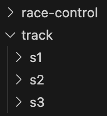
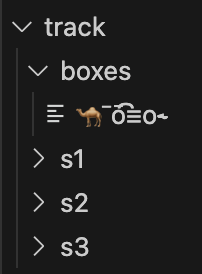
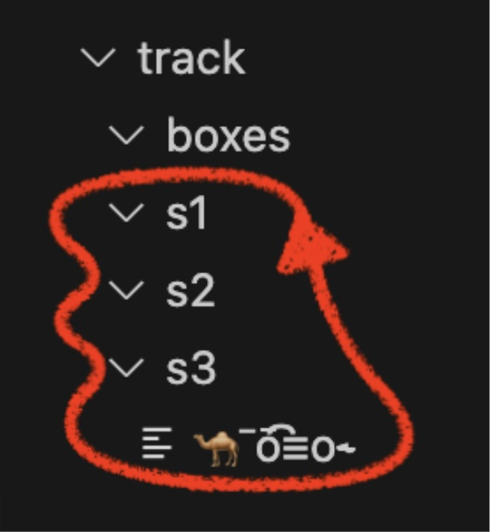
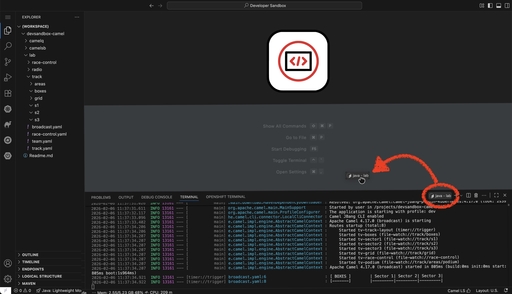
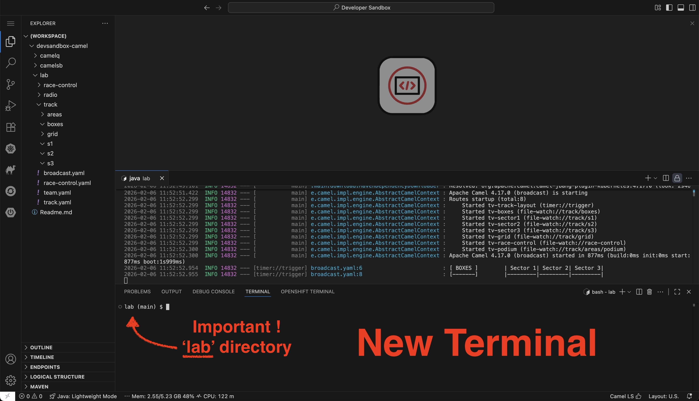
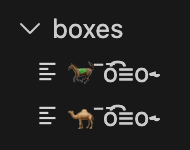
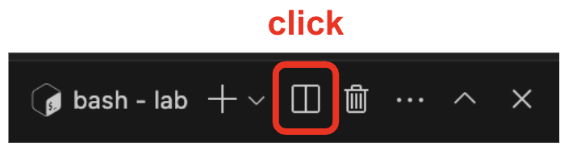
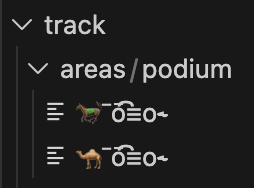

:walkthrough: Camel JBang Formula 1 race
:user-password: openshift
:namespace: {user-username}-devspaces

// URLs
:codeready-url: http://devspaces.{openshift-app-host}/

:experimental:

// WORKS
:style-kbd: kbd { \
  color: black; \
  background-color: lightgrey; \
  border: 1px solid black; \
  box-shadow: 0px 1px black; \
  font-size: .85em; \
  line-height: .85em; \
  display: inline-block; \
  font-weight: 600; \
  letter-spacing: .05em; \
  padding: 3px 5px; \
  white-space: nowrap; \
  border-radius:5px; \
} \

:cp-btn: pass:[<svg fill="currentColor" height="1em" width="1em" viewBox="0 0 448 512" aria-hidden="true" role="img" style="vertical-align: -0.125em;"> <path d="M320 448v40c0 13.255-10.745 24-24 24H24c-13.255 0-24-10.745-24-24V120c0-13.255 10.745-24 24-24h72v296c0 30.879 25.121 56 56 56h168zm0-344V0H152c-13.255 0-24 10.745-24 24v368c0 13.255 10.745 24 24 24h272c13.255 0 24-10.745 24-24V128H344c-13.2 0-24-10.8-24-24zm120.971-31.029L375.029 7.029A24 24 0 0 0 358.059 0H352v96h96v-6.059a24 24 0 0 0-7.029-16.97z"></path></svg>]

:style-summary: summary {cursor: pointer; list-style: none;}
:style-triangle: .triangle {margin-right: .5em;} summary:hover .sumtext {text-decoration: underline;}
:style-details:  .triangle::before {content: "▶";} details[open] .triangle::before {content: "▼";}
:style-open-close: {style-summary}{style-triangle}{style-details} 

:style-preview: pre {background-color: #272822; color: white; padding: 5px 15px; font-size: 15px}
:style-indent: .indent2 {padding-left: 2rem;}
:style-all: pass:a[]

:url-docserver: https://docserver-webapp.{openshift-app-host}
//:url-docserver: http://0.0.0.0:8080

:docserver-status: pass:a[ response.text()) \
        .then(data => this.parentElement.innerHTML = 'Status: 

&nbsp;
') \
        .catch(error => this.parentElement.innerHTML = 'Status: 

&nbsp;
') \
      ">]

:freplace: pass:[function replaceTokens(templateString, values) { \
    const valueArray = values.split(',').map(val => val.trim()); \
    let result = templateString; \
    let replaceIndex = 0; \
    while (result.includes('REPLACE') && replaceIndex < valueArray.length) { \
        result = result.replace('REPLACE', valueArray[replaceIndex]); \
        replaceIndex++; \
    } \
    return result; \
}]

:fdocserver: pass:a[function docserver(target,template,params) { \
    {freplace} \
    fetch('{url-docserver}/roomid?user='+params) \
        .then(response => response.text()) \
        .then(data => {target.firstChild.data=replaceTokens(text, data);}) \
        .catch(error => room = 'Error fetching data: ' + error.message); \
}]

:fcopy: pass:a[function copy(el) { \
  el.previousElementSibling.select(); \
  text = el.previousElementSibling.textContent; \
  console.log(text); \
  navigator.clipboard.writeText(text + '\n') \
        .then(response => console.log('Text with carriage return copied to clipboard!')) \
        .catch(err => console.error('Failed to copy: ', err)); \
}]

:copypaste: pass:a[ \

 \
  <textarea readonly style="field-sizing: content;border: none; background-color: #f0f0f0; width: 100%; resize: none; font-size:14px; font-family: monospace;padding: 5px 15px" rows="1">function example() { \
  console.log("Hello {replace-with-previous}!"); \
  return true; \
}</textarea> \
  <button class="mytooltip" onclick="{fcopy} copy(this);" style="border: none; background-color: white; padding: 5px 15px; border-bottom: 1px solid transparent; transition: border-bottom-color 0.2s;"> \
    <svg fill="currentColor" height="1em" width="1em" viewBox="0 0 448 512" aria-hidden="true" role="img" style="vertical-align: -0.125em;"> \
      <path d="M320 448v40c0 13.255-10.745 24-24 24H24c-13.255 0-24-10.745-24-24V120c0-13.255 10.745-24 24-24h72v296c0 30.879 25.121 56 56 56h168zm0-344V0H152c-13.255 0-24 10.745-24 24v368c0 13.255 10.745 24 24 24h272c13.255 0 24-10.745 24-24V128H344c-13.2 0-24-10.8-24-24zm120.971-31.029L375.029 7.029A24 24 0 0 0 358.059 0H352v96h96v-6.059a24 24 0 0 0-7.029-16.97z"></path> \
    </svg> \
    Copy to clipboard \
  </button> \
   \

 \
 \
]

:fcopy-no-new-line: pass:a[function copy(el) { \
  el.previousElementSibling.select(); \
  text = el.previousElementSibling.textContent; \
  console.log(text); \
  navigator.clipboard.writeText(text) \
        .then(response => console.log('Text with carriage return copied to clipboard!')) \
        .catch(err => console.error('Failed to copy: ', err)); \
}]

:copy-open: pass:a[ \

 \
  <textarea readonly style="field-sizing: content;border: none; background-color: #f0f0f0; width: 100%; resize: none; font-size:14px; font-family: monospace;padding: 5px 15px" rows="1">]

:copy-close: pass:a[</textarea> \
  <button class="mytooltip" onclick="{fcopy-no-new-line} copy(this);" style="border: none; background-color: white; padding: 5px 15px; border-bottom: 1px solid transparent; transition: border-bottom-color 0.2s;"> \
    <svg fill="currentColor" height="1em" width="1em" viewBox="0 0 448 512" aria-hidden="true" role="img" style="vertical-align: -0.125em;"> \
      <path d="M320 448v40c0 13.255-10.745 24-24 24H24c-13.255 0-24-10.745-24-24V120c0-13.255 10.745-24 24-24h72v296c0 30.879 25.121 56 56 56h168zm0-344V0H152c-13.255 0-24 10.745-24 24v368c0 13.255 10.745 24 24 24h272c13.255 0 24-10.745 24-24V128H344c-13.2 0-24-10.8-24-24zm120.971-31.029L375.029 7.029A24 24 0 0 0 358.059 0H352v96h96v-6.059a24 24 0 0 0-7.029-16.97z"></path> \
    </svg> \
    Copy to clipboard \
  </button> \
   \

 \
]

:snippet: pass:a[ \

 \

 \
 \
]

ifdef::env-github[]
endif::[]

[id='full-throttle']
= Camel JBang - Full Throttle

Jump into Camel JBang with a thrilling motor racing simulation. Prototype, iterate, and test your integrations at maximum speed.

image::images/illustration.jpg[align="left", width=80%]

{empty} +

This chapter is an introductory taste of _Camel JBang_ showing you a basic group of commands. Hopefully you'll get to see how much you can sharpen your axe when making a good use of _Camel JBang_. 

[NOTE]
====
Familiarity with Apache Camel is helpful but not required to complete this lab. If you have little or no prior experience, consider reviewing an introduction to Enterprise Integration Patterns and Apache Camel first:

* link:https://developers.redhat.com/products/red-hat-build-of-apache-camel[Red Hat build of Apache Camel (enterprise-focused overview),window="_blank", , id="rhd-apache-camel"]
====

{empty} +

[time=5]
[id='racing-track']
== Build a racing track
{style-all}

This chapter is an introductory taste of _Camel JBang_ in a motoracing context: a racing track with three sectors and a boxes area, plus racing teams that participate in practice and race sessions.

//When developers are tasked to deliver a solution, prototyping and experimentation are crucial. _Camel JBang_ is one of those key prototyping tools.

_Camel JBang_ is a command-line interface (CLI) that accelerates prototyping by letting developers quickly create, validate, and tweak flows without complex setups, making it perfect for rapid experimentation.

image::images/camel-jbang.png[align="left", width=40%]

// {empty} +

{empty} +

=== Open a terminal

Whether you're working in your local machine or from Dev Spaces, you'll need to open a terminal. If you're working locally we recommend using VS Code as the examples below are based on this editor, but you can use any other terminal you prefer.

Open a terminal following the steps illustrated below (Dev Spaces example):

image::images/terminal-open.png[align="left", width=40%]

{empty}

The picture below shows the terminal in VS Code.

image::images/terminal.png[align="left", width=100%]

{empty} +

Click the {cp-btn} button (Copy to clipboard), and paste in your terminal:

--
{copypaste}
----
mkdir lab
cd lab
----
--

image::images/terminal-copypaste.png[width=50%]

{empty} +

When created the first time, your `lab` directory is empty:

--
[.indent2]
📁 workshop +
&nbsp;&nbsp;📁 *lab* +
pass:[<mark style="padding-left: 1rem; background-color: white; color: grey"></mark>] [empty]
--

{empty} +

=== Build a racing track

Your town got a permit to build a racing track in the area.

This racing track will be straight forward to build:

* It will essentially consist of 3 sectors (s1, s2 and s3).
* Each sector takes a random amount of time to cover.
* After sector 3, cars may continue around the track or return to the box area depending on racecontrol directives (signals).

{empty} +

The box area is where teams can work on their car. When a racing car leaves boxes it will go round and round the track covering all 3 sectors in each lap. Race control can signal when all cars have to return to boxes.

Click the {cp-btn} button (Copy to clipboard), and paste in your terminal to create your racing `track.yaml` file:

--
{copypaste}
----
cat <<'EOF' > track.yaml
- route:
    id: sector1
    from:
      uri: file:track/s1
      parameters:
        delete: true
      steps:
        - delay:
            simple: "${random(4000,6000)}"
        - to:
            uri: file:track/s2

- route:
    id: sector2
    from:
      uri: file:track/s2
      parameters:
        delete: true
      steps:
        - delay:
            simple: "${random(4000,6000)}"
        - to:
            uri: file:track/s3

- route:
    id: sector3
    from:
      uri: file:track/s3
      parameters:
        delete: true
      steps:
        - delay:
            simple: "${random(4000,6000)}"
        - choice:
            when:
              - simple: ${variable.global:race-control} == 'boxes'
                steps:
                  - to:
                      uri: file:track/boxes
              - simple: ${variable.global:race-control} == 'last-lap'
                steps:
                  - setVariable:
                      name: global:finish-position
                      simple: ${variable.global:finish-position}++
                  - setBody:
                      simple: ${variable.global:finish-position}
                  - to:
                      uri: file:track/areas/podium
            otherwise:
              steps:
                - to:
                    uri: file:track/s1

- route:
    id: signals
    from:
      uri: file-watch
      parameters:
        path: race-control
      steps:
        - setVariable:
            name: global:race-control
            simple: ${body}

- route:
    id: init
    from:
      uri: timer:init
      parameters:
        repeatCount: 1
      steps:
        - setVariable:
            name: global:finish-position
            constant: 0
EOF
----
--

[NOTE]
====
Two additional routes provide flow control for the track:

- `signals`: retains in a variable the last race-control directive.
- `init`: initializes the finish position variable, used to assign the finishing position to the cars.
====

You should see the new YAML file in your file explorer:

--
[.indent2]
📁 lab +
pass:[<mark style="padding-left: 1rem; background-color: white; color: purple"><b><i>&nbsp;!&nbsp;&nbsp;</i></b></mark>]*track.yaml* +
--

{empty} +

=== Run the track 

Everyone is excited with the newly built track in the region. +
Open its doors so that teams can arrive and drive around it.

Click the {cp-btn} button (Copy to clipboard), and paste in your terminal:

--
{copypaste}
----
camel run track.yaml --background
----
--

NOTE: The `--background` flag runs the process detached.

You should see an output in your terminal similar to:

++++
<pre style="background-color: #1e1e1e; color: #d4d4d4; padding: 12px; font-family: monospace;font-size: 12px; line-height: 1.1;">
Running Camel integration: track in background with PID: 6381
</pre>
++++

{blank}

Notice in your file explorer a set of directories describing your physical track:

NOTE: Make sure you unfold (down arrow *⋁* ) the track folder to display the sectors.

NOTE: The track watches the `race-control` directory, necessary for sector 3.

{empty} +

=== Set up a race control system

Any serious racing circuit requires a dedicated race control room.

Race control is responsible for:

* Communicating directives to teams, including:
** Signalling the start of a practice session
** Signalling return to the pits
** Signalling grid formation for the race
* Triggering the race start sequence and starting the race

{empty} +

Click the {cp-btn} button (Copy to clipboard), and paste in your terminal to put together your `race-control.yaml` crew:

--
{copypaste}
----
cat <<'EOF' > race-control.yaml
- route:
    id: directives
    from:
      uri: direct:directive
      steps:
        - to:
            uri: file:race-control
            parameters:
              fileName: message

- route:
    id: start-sequence
    autoStartup: false
    from:
      uri: timer:start-sequence?repeatCount=1
      steps:
        - setHeader:
            name: CamelFileName
            constant: message
        - loop:
            constant: 3
            steps:
            - setBody:
                simple: light-turns-red-${exchangeProperty.CamelLoopIndex}
            - to:
                uri: file:race-control
            - delay:
                constant: 2000
        - setBody:
            constant: light-turns-green
        - to:
            uri: file:race-control
        - loop:
            doWhile: true
            simple: ${body}
            steps:
              - poll:
                  timeout: "1000"
                  uri: file:track/grid?delete=true
              - filter:
                  simple: ${body} != null
                  steps:
                    - to:
                        uri: file:track/s1
EOF
----
--

NOTE: The route with id `race-start-sequence` has `autoStartup: false`). It needs to be started manually. Race-control will start it when the time comes to commence the race.

At this point, you should see the following sources in your file explorer:

--
[.indent2]
📁 lab +
pass:[<mark style="padding-left: 1rem; background-color: white; color: purple"><b><i>&nbsp;!&nbsp;&nbsp;</i></b></mark>]*race-control.yaml* +
pass:[<mark style="padding-left: 1rem; background-color: white; color: purple"><b><i>&nbsp;!&nbsp;&nbsp;</i></b></mark>]*track.yaml* +
--

{empty} +

Instruct personel to get in position and turn on the race control system. +
Run the race control system:

--
{copypaste}
----
camel run race-control.yaml --background
----
--

Verify everyone is ready by running the command:

--
{copypaste}
----
camel ps
----
--

You should see in your terminal the following output:

++++
<pre style="background-color: #1e1e1e; color: #d4d4d4; padding: 12px; font-family: monospace; font-size: 12px; line-height: 1.1;">
  PID   NAME          READY  STATUS   AGE  TOTAL  FAIL  INFLIGHT   
 10513  track          1/1   Running  23s      1     0         0   
 10725  race-control   1/1   Running   6s      1     0         0 
</pre>
++++

{blank}

If you see the same output, then the track is ready, race control is on duty, teams can now arrive at the track and parcipate on racing sessions.

{empty} +

[type=verification]
Do you see the track and race control processes running?

[type=verificationFail]
Make sure you follow the commands above. Try again.

[type=verificationSuccess]
Good! Let's move on to the next step.

[time=4]
[id='camel-racing-team']
== Put a team together
{style-all}

You found the sponsorship you needed to put together the racing team of your dreams:

++++
&nbsp;&nbsp;🐪&nbsp;<b>Team Camel Racing</b>&nbsp;🐪
++++

{empty} +

A racing team can participate in practice and race sessions. Teams like to decorate their cars in distinctive colors and display sponsorship logos: this is called a livery. We'll use 🐪 as the default livery, but it can be configured with different values for other teams.

[NOTE]
====
The list below outlines the key responsibilities of the team:

* Unbox and deploy the racing car in boxes upon arrival at the venue
* Drive the car to the track when the practice session begins
* Radio instructions to the driver during sessions
* Pack up equipment and leave the venue at the end of the day
====

Click the {cp-btn} button (Copy to clipboard), and paste in your terminal to create your racing `team.yaml` file:

--
{copypaste}
----
cat <<'EOF' > team.yaml
# Place the car in the boxes when the team arrives at the track:
- route:
    from:
      uri: "timer:trigger?repeatCount=1"
      steps:
        - to:
            uri: file:track/boxes
            parameters:
              allowNullBody: true
              fileName: "{{livery:🐪}}‾ō͡≡o˞̶"

# The crew reacts when the practice session opens, the car drives off to the track
- route:
    from:
      uri: file-watch
      parameters:
        path: race-control
      steps:
        - filter:
            simple: "${body} == 'practice'"
            steps:
              - poll:
                  uri: file:track/boxes?fileName={{livery:🐪}}‾ō͡≡o˞̶&delete=true
              - to:
                  uri: file:track/s1
        - filter:
            simple: "${body} == 'grid'"
            steps:
              - poll:
                  uri: file:track/boxes?fileName={{livery:🐪}}‾ō͡≡o˞̶&delete=true
              - to:
                  uri: file:track/grid

# Radio messages: the team reacts to race control directives and talks to the driver
- route:
    id: team-radio
    from:
      uri: file-watch
      parameters:
        path: race-control
      steps:
      - choice:
          when:
            - simple: ${body} == 'boxes'
              steps:
                - setBody:
                    simple: "{{livery:🐪}} Please enter boxes at the end of the lap!"
            - simple: ${body} == 'practice'
              steps:
                - setBody:
                    simple: "{{livery:🐪}} Green light for practice, let's get some laps in!"
            - simple: ${body} == 'grid'
              steps:
                - setBody:
                    simple: "{{livery:🐪}} The race is about to start, please drive the car to the grid."
            - simple: ${body} == 'light-turns-green'
              steps:
                - setBody:
                    simple: "{{livery:🐪}} Good start! mind your brakes still need to gain temperature."
            - simple: ${body} == 'last-lap'
              steps:
                - setBody:
                    simple: "{{livery:🐪}} This is the last lap, bring the car home!"
          otherwise:
            steps:
            - setBody:
                simple: "ignore"
      - filter:
          simple: ${body} != "ignore"
          steps:
          - to:
              uri: file:radio?fileName=team-{{livery:🐪}}

# Radio messages: the team congratulates the drive when the race ends
- route:
    from:
      uri: file-watch
      parameters:
        path: track/areas/podium
        antInclude: "{{livery:🐪}}‾ō͡≡o˞̶"
      steps:
      - choice:
          when:
          - simple: ${body} == '1'
            steps:
            - setBody:
                simple: "{{livery:🐪}} Absolutely amazing! You're the WINNER! "
          otherwise:
            steps:
            - setBody:
                simple: "{{livery:🐪}} Awesome drive! great result for the team."
      - to:
          uri: file:radio?fileName=team-{{livery:🐪}}

# Helper bean to retire the car and leave the venue.
- beans:
    - name: "raceTeam"
      type: java.lang.Object
      destroyMethod: removeCar
      scriptLanguage: groovy
      script: |
        class RaceTeam {
            void removeCar() {
              def trackAreas = [
                  'track/areas/podium/{{livery:🐪}}‾ō͡≡o˞̶',
                  'track/boxes/{{livery:🐪}}‾ō͡≡o˞̶',
                  'track/grid/{{livery:🐪}}‾ō͡≡o˞̶',
                  'track/s1/{{livery:🐪}}‾ō͡≡o˞̶',
                  'track/s2/{{livery:🐪}}‾ō͡≡o˞̶',
                  'track/s3/{{livery:🐪}}‾ō͡≡o˞̶'
              ];

              def file = trackAreas.find { new File(it).exists() }?.with { new File(it) };

              if (file?.exists())
                file.delete();
            }
        }
        return new RaceTeam()
EOF
----
--

{empty} +

At this point, you should see the following sources in your file explorer:

--
[.indent2]
📁 lab +
pass:[<mark style="padding-left: 1rem; background-color: white; color: purple"><b><i>&nbsp;!&nbsp;&nbsp;</i></b></mark>]*race-control.yaml* +
pass:[<mark style="padding-left: 1rem; background-color: white; color: purple"><b><i>&nbsp;!&nbsp;&nbsp;</i></b></mark>]*team.yaml* +
pass:[<mark style="padding-left: 1rem; background-color: white; color: purple"><b><i>&nbsp;!&nbsp;&nbsp;</i></b></mark>]*track.yaml* +
--

{empty} +

=== First private session of practice

Everyone is eager to see the new team and its ground breaking racing car. A shakedown will take place during a private session of practice.

Run the team to kickstart the day. 

Click the {cp-btn} button (Copy to clipboard), and paste in your terminal:

--
{copypaste}
----
camel run team.yaml --name teamCamel --background
----
--

NOTE: The `--name teamCamel` gives this Camel process a distinct name.

After a moment, you should see the *Team Camel* deploying its beautiful racing car in their allocated pit box.

[NOTE]
====
- Click pass:[↻] to refresh your project file explorer.

- Make sure to *unfold* the boxes directory to see the *Team Camel* car.
====

{empty} +

=== Open the track for practice

You are the race director (the boss!).

You are responsible for opening the practice session and signaling the teams to start driving around the track.

What are you waiting for?

Click the {cp-btn} button (Copy to clipboard), and paste in your terminal to issue the command to open the practice session:
--
{copypaste}
----
camel cmd send race-control --uri direct:directive --body practice
----
--

[NOTE]
====
`cmd send` is a command to send a message with Camel JBang:.

* `race-control` is the target process
* `direct:directive` is the target endpoint in that process
* `practice` is the body of the message to send
====

Soon after, you should see *Team Camel Racing* hitting the road and lapping around the track covering all three sectors.

NOTE: Make sure you unfold (down arrow *⋁* ) all sector directories to see the car lapping around the track.

{blank}

Let the car cover good distance to gather all the data it needs.

{empty} +

=== Order return to boxes

The time window for the morning session is over. It's time to order the team to return to the boxes.

Click the {cp-btn} button (Copy to clipboard), and paste in your terminal:
--
{copypaste}
----
camel cmd send race-control --uri direct:directive --body boxes
----
--

NOTE: You may need to wait for the car to get to the last sector to return to the boxes.

{blank}

Feel free to let the car go back on track to put more mileage under its belt. +
The more laps it covers the more data the team can collect for analysis and car improvement.

{empty} +

=== End of the day

It was a good day for *Team Camel Racing*, they can bring valuable data to the factory and prepare for the race event. +
Time to go home and get some well deserved rest.

Click the {cp-btn} button (Copy to clipboard), and paste in your terminal to tell `Team Camel Racing` to end their working day:

--
{copypaste}
----
camel stop teamCamel
----
--

NOTE: With `teamCamel`, _Camel JBang_  only stops the running process with that name.

NOTE: For convenience, we leave all the other processes (the track and race control) running to prepare for the race day.

{empty} +

[type=verification]
Did *Team Camel Racing* leave the track? (did the process stop?)

[type=verificationFail]
Make sure you followed the commands above. Try again.

[type=verificationSuccess]
Good! Team Camel Racing will crunch the data they collected and will get ready for a race day event.

[time=6]
[id='race-event']
== Open the race event
{style-all}

The day of the race is here. Big crowds are expected to attend.

[NOTE]
====
Verify the processes below are still running:
++++
<pre style="background-color: #1e1e1e; color: #d4d4d4; padding: 12px; font-family: monospace; font-size: 12px; line-height: 1.1;">
 PID    NAME          READY  STATUS    AGE    TOTAL  FAIL  INFLIGHT   
 10513  track          1/1   Running  22m55s    138     0         0   
 10725  race-control   1/1   Running  20m34s      2     0         0 
</pre>
++++

Use the command:

--
{copypaste}
----
camel ps
----
--

You should see in your terminal an output similar to the one from above.

====

{empty} +

=== Media coverage

In preparation for such a big event we've organized commercial broadcasting for the event. Fans from all over the world will be able to watch the race live on their screens.

The code below sets up the media coverage, with multiple cameras on track, enabling the transmission of the race to multiple media channels.

[NOTE]
====
In summary, the broadcasting system:

- presents the track to spectators
- follows cars around the different areas of the track (boxes, sectors and grid)
- monitors race control directives
- displays crucial information to spectators
====

Click the {cp-btn} button (Copy to clipboard), and paste in your terminal to create your `broadcast.yaml` file:

--
{copypaste}
----
cat <<'EOF' > broadcast.yaml
- route:
    id: tv-track-layout
    from:
      uri: "timer:layout?repeatCount=1"
      steps:
        - filter:
            simple: ${variable.global:hide} == null
            steps:
            - log:
                message: "[ BOXES ]        | Sector 1| Sector 2| Sector 3|"
            - log:
                message: "[-------]        |---------|---------|---------|"
            - setVariable:
                name: global:hide
                constant: true

- route:
    id: tv-boxes
    from:
      uri: file-watch
      parameters:
        path: track/boxes
        events: CREATE
      steps:
        - log:
            message: "[${header.CamelFileName}]        |         |         |         |"

- route:
    id: tv-sector1
    from:
      uri: file-watch
      parameters:
        path: track/s1
        events: CREATE
      steps:
        - log:
            message: "[       ]        | ${header.CamelFileName} |         |         |"

- route:
    id: tv-sector2
    from:
      uri: file-watch
      parameters:
        path: track/s2
        events: CREATE
      steps:
        - log:
            message: "[       ]        |         | ${header.CamelFileName} |         |"

- route:
    id: tv-sector3
    from:
      uri: file-watch
      parameters:
        path: track/s3
        events: CREATE
      steps:
        - log:
            message: "[       ]        |         |         | ${header.CamelFileName} |"

- route:
    id: tv-grid
    from:
      uri: file-watch
      parameters:
        path: track/grid
        recursive: false
        events: CREATE
      steps:
        - log:
            message: "[       ] ${header.CamelFileName}|         |         |         |"

- route:
    id: tv-race-control
    from:
      uri: file-watch
      parameters:
        path: race-control
      steps:
        - filter:
            simple: "${body} == 'grid'"
            steps:
              - log:
                  message: "[       ]        |         |         |         |"
              - log:
                  message: "[-------]- Grid -|---------|---------|---------|"
              - log:
                  message: "[       ]        |         |         |         |"
        - filter:
            simple: "${body} starts with 'light-turns-red'"
            steps:
            - log:
                message: "[       ]        🔴        |         |         |"
        - filter:
            simple: "${body} == 'light-turns-green'"
            steps:
            - log:
                message: "[       ]        🟢        |         |         |"
        - filter:
            simple: "${body} == 'last-lap'"
            steps:
            - log:
                message: "[       ]        |         |         |         |  Last lap!"

- route:
    id: tv-podium
    from:
      uri: file-watch
      parameters:
        path: track/areas/podium
        events: CREATE
      steps:
        - choice:
            when:
            - simple: ${body} == '1'
              steps:
              - log:
                  message: "[       ]        |         |         |         | 🏁 ${header.CamelFileName} 🏆"
            otherwise:
              steps:
              - log:
                  message: "[       ]        |         |         |         | 🏁 ${header.CamelFileName}"
EOF
----
--

{empty} +

At this point, you should see the following sources in your file explorer:

--
[.indent2]
📁 lab +
pass:[<mark style="padding-left: 1rem; background-color: white; color: purple"><b><i>&nbsp;!&nbsp;&nbsp;</i></b></mark>]*broadcast.yaml* +
pass:[<mark style="padding-left: 1rem; background-color: white; color: purple"><b><i>&nbsp;!&nbsp;&nbsp;</i></b></mark>]*race-control.yaml* +
pass:[<mark style="padding-left: 1rem; background-color: white; color: purple"><b><i>&nbsp;!&nbsp;&nbsp;</i></b></mark>]*team.yaml* +
pass:[<mark style="padding-left: 1rem; background-color: white; color: purple"><b><i>&nbsp;!&nbsp;&nbsp;</i></b></mark>]*track.yaml* +
--

{empty} +

The broadcasting system is in place, initiate the live televised transmission:

--
{copypaste}
----
camel run broadcast.yaml --dev
----
--

NOTE: The `--dev` flag enables *development mode*, a powerful feature of Camel JBang allowing the developer to make code changes on the fly.

From this point onwards, your terminal effectively becomes your TV screen pass:[📺] where you'll be able to watch the race unfold.

When the televised program starts, it first introduces the circuit's layout, displaying the boxes area and the 3 track sectors, as shown below:

// Your pass:[📺] screen will show the track's layout:

++++
<pre style="background-color: #1e1e1e; color: #d4d4d4; padding: 12px; font-family: monospace;font-size: 12px; line-height: 1.1;">
[ BOXES ]     | Sector 1| Sector 2| Sector 3|
[-------]     |---------|---------|---------|
</pre>
++++

NOTE: Later, *development mode* will allow us to readjust the live televised transmission while the race   is ongoing.

{empty} +

=== Open a second Terminal

Since your current terminal is now where you will watch the televised race, open a second terminal to work in.

For the best race viewing experience, arrange your terminals horizontally. If you are using VS Code or DevSpaces, you can do this with a drag and drop operation.

Follow the steps as illustrated below:

NOTE: The example below is for DevSpaces, but the process is similar for VS Code. +
If using your local machine, you can equally organize your local terminals horizontally.

1. *Drag and drop* the current terminal around the lower center of the area above:
+

+
{blank}
+
1. Then open a *new terminal* using the menus:
+

+
{empty} +
+
{empty} +
+
1. Lastly, *pass:[VERY IMPORTANT 👀]*
+
[IMPORTANT]
====
In the new terminal, make sure you switch to the `*lab*` directory:

--
{copypaste}
----
cd lab
----
--
====
+
You're all set to continue with the next step.
+
{empty} +

=== The racing teams

For a proper race, we need to deploy multiple participating teams.

* *Team Camel Racing*
+
=====
Team Camel Racing (woot woot!), is the first to open their box.

Click the {cp-btn} button (Copy to clipboard), and paste in your terminal to deploy the team:
--
{copypaste}
----
camel run team.yaml --name teamCamel --background
----
--
=====

{empty} +

* *Team Cavallino Racing*
+
=====
And our big rivals (boooo!!) have arrived too, Team Cavallino Racing, with an incredible heritage and legendary wins over the course of history.

Click the {cp-btn} button (Copy to clipboard), and paste in your terminalto deploy the team:
--
{copypaste}
----
camel run team.yaml --name teamCavallino  --property=livery=🐎 --background
----
--

[NOTE]
--
With `--property` we can customize the team's livery. +
Here we set it to pass:[🐎] for *Team Cavallino Racing*.
--
=====

The fortunate ones with grandstands seating right in front of the pit area will see the cars in their boxes:

{blank}

Many say watching races on TV is better, not missing out on any details:

++++
<pre style="background-color: #1e1e1e; color: #d4d4d4; padding: 12px; font-family: monospace; font-size: 12px; line-height: 1.1;">
[ BOXES ]        | Sector 1| Sector 2| Sector 3|
[-------]        |---------|---------|---------|
[🐪‾ō͡≡o˞̶]        |         |         |         |
[🐎‾ō͡≡o˞̶]        |         |         |         |
</pre>
++++

{blank}

TIP: Feel free to deploy as many teams as you want to make the race more exciting.

Cars are warming up and soon they'll leave boxes for the main day event to start.

{empty} +

=== Listen to team radio messages

Teams are constantly communicating with their drivers to provide instructions and updates. It's interesting to tune in as it gives great insights into the team's strategy and the driver's performance.

In your lower terminal, click the `split` button to open a new terminal side by side:

{blank}

Your new terminal will show on the side of the first terminal:

image::images/terminal-split-result.jpg[align="left", width=80%]

{blank}

In the new terminal, copy and paste the command below to listen to team radio messages:

--
{copypaste}
----
camel cmd receive --uri file-watch:radio --only-body
----
--

[NOTE]
====
`cmd receive` is another powerful command from Camel JBang. Use it to consume outputs generated by Camel.

* `file-watch:radio` is the consumer
* `--only-body` is a flag to only show the body of the message
====

The output will show:

++++
<pre style="background-color: #1e1e1e; color: #d4d4d4; padding: 12px; font-family: monospace; font-size: 12px; line-height: 1.1;">
Waiting for messages ...
Waiting for messages ...
</pre>
++++

NOTE: You see 2 lines ("waiting for messages...") because the command is capturing messages from both *Team Camel* and *Team Cavallino*.

As the event gets underway, you’ll see team radio messages appearing in your terminal.

{empty} +

[type=verification]
Are both teams ( *Team Camel Racing* and *Team Cavallino Racing* ) ready to start the race? (in boxes?)

[type=verificationFail]
Make sure you followed the commands above. Try again.

[type=verificationSuccess]
Great! It's time to start the race. 

[type=verification]
Is your radio terminal turned on? (waiting for team messages?)

[type=verificationFail]
Make sure you followed the commands above. Try again.

[type=verificationSuccess]
Nice! it'll be interesting to listen to the team messages as the race progresses.

[time=6]
[id='race-start']
== Grid formation and race start
{style-all}

The grandstands are full and crowds are excited.

We're now just moments away from the scheduled race start. As always, launching the race follows a strict protocol to ensure maximum safety and fairness for all competitors.

=== Grid formation

As the race director, you need to signal the teams to place their cars on the grid.

--
{copypaste}
----
camel cmd send race-control --uri direct:directive --body grid
----
--

[NOTE]
====
`cmd send` is a command to send a message with Camel JBang:.

* `race-control` is the target process
* `direct:directive` is the target endpoint in that process
* `grid` is the body of the message to send
====

Soon after, you should see teams moving their cars to their grid positions to start the race.

++++
<pre style="background-color: #1e1e1e; color: #d4d4d4; padding: 12px; font-family: monospace; font-size: 12px; line-height: 1.1;">
[ BOXES ]        | Sector 1| Sector 2| Sector 3|
[-------]        |---------|---------|---------|
[🐪‾ō͡≡o˞̶]        |         |         |         |
[🐎‾ō͡≡o˞̶]        |         |         |         |
[       ]        |         |         |         |
[-------]- Grid -|---------|---------|---------|
[       ]        |         |         |         |
[       ] 🐪‾ō͡≡o˞̶|         |         |         |
[       ] 🐎‾ō͡≡o˞̶|         |         |         |
</pre>
++++

{blank}

Teams can still work on their cars while on the grid for last minute adjustments, but will soon have to leave the grid.

{empty} +

=== Start the race

Mechanics and all other crew members have now left the grid. It is just the drivers and their machines on the tarmac. Engines are rumbling and spectators are waiting with great anticipation for the race to start.

The start sequence is more intricate than people think. To prevent any human error, it's been all automated.
We rely on the automatic procedure to signal the start of the race.

Click the {cp-btn} button (Copy to clipboard), and paste in your terminal to start the race:
--
{copypaste}
----
camel cmd start-route --id start-sequence race-control
----
--

[NOTE]
====
`cmd start-route` is a command to start a route with Camel JBang.

* `start-sequence` is the id of the route to start
* `race-control` is the target process
====

NOTE: The route `start-sequence` was originally defined with the `autoStartup: false` preventing it from starting automatically. The command above starts the route manually.

Lights will turn red and then green, indicating the start of the race:

++++
<pre style="background-color: #1e1e1e; color: #d4d4d4; padding: 12px; font-family: monospace; font-size: 12px; line-height: 1.1;">
[       ]        🔴  |         |         |
[       ]        🔴  |         |         |
[       ]        🔴  |         |         |
[       ]        🟢  |         |         |
[       ]        | 🐪‾ō͡≡o˞̶ |         |         |
[       ]        | 🐎‾ō͡≡o˞̶ |         |         |
</pre>
++++

{empty} +

=== Watch the race unfold

You'll see the cars racing each other, from time to time you may see some overtakes happening. +
The example below shows a couple of laps:

++++
<pre style="background-color: #1e1e1e; color: #d4d4d4; padding: 12px; font-family: monospace; font-size: 12px; line-height: 1.1;">
[       ]        | 🐪‾ō͡≡o˞̶ |         |         |
[       ]        | 🐎‾ō͡≡o˞̶ |         |         |
[       ]        |         | 🐪‾ō͡≡o˞̶ |         |
[       ]        |         | 🐎‾ō͡≡o˞̶ |         |
[       ]        |         |         | 🐎‾ō͡≡o˞̶ |
[       ]        |         |         | 🐪‾ō͡≡o˞̶ |
[       ]        | 🐎‾ō͡≡o˞̶ |         |         |
[       ]        | 🐪‾ō͡≡o˞̶ |         |         |
[       ]        |         | 🐎‾ō͡≡o˞̶ |         |
[       ]        |         | 🐪‾ō͡≡o˞̶ |         |
[       ]        |         |         | 🐪‾ō͡≡o˞̶ |
[       ]        |         |         | 🐎‾ō͡≡o˞̶ |
</pre>
++++

NOTE: in the example above, overtakes took place on Sector 3. Notice how *teamCavallino* overtook *teamCamel*, and in the next lap *teamCamel* got first place back.

=== Behind the Scenes: Broadcasting Upgrade

Innevitably the cost of broadcasting races isn't economically viable unless another source of income is found. For that reason we decided to upgrade the broadcast system to include advertising.

This is when the *development mode* of Camel JBang comes in handy, allowing for on-the-fly changes to the broadcast system while the live transmission is ongoing.

The command below appends code to `broadcast.yaml`. +
Click the {cp-btn} button (Copy to clipboard), and paste in your terminal:

--
{copypaste}
----
cat << 'EOF' >> broadcast.yaml

- route:
    id: tv-commercials
    from:
      uri: "direct:commercial"
      steps:
        - log:
            message: "|----------------------------------------------|"
        - log:
            message: "| ${body}"
        - log:
            message: "|----------------------------------------------|"
EOF
----
--

NOTE: The new route is added to the `broadcast.yaml`. It opens a new interface to display commercials. 

You'll see the broadcast process react to the code changes and hot reload the routes. +
Your terminal output will display something like:

++++
<pre style="background-color: #1e1e1e; color: #d4d4d4; padding: 12px; font-family: monospace; font-size: 12px; line-height: 1.1;">
Routes reloaded summary (total:9 started:9)
    Started tv-track-layout (timer://layout) (source: broadcast.yaml:4)
    Started tv-boxes (file-watch://track/boxes) (source: broadcast.yaml:20)
    Started tv-sector1 (file-watch://track/s1) (source: broadcast.yaml:31)
    Started tv-sector2 (file-watch://track/s2) (source: broadcast.yaml:42)
    Started tv-sector3 (file-watch://track/s3) (source: broadcast.yaml:53)
    Started tv-grid (file-watch://track/grid) (source: broadcast.yaml:64)
    Started tv-race-control (file-watch://race-control) (source: broadcast.yaml:76)
    Started tv-podium (file-watch://track/areas/podium) (source: broadcast.yaml:108)
    Started tv-commercials (direct://commercial) (source: broadcast.yaml:145)
</pre>
++++

NOTE: Notice highlighted in yellow the new route `tv-commercials` now also included in the process.

Under our new contractual terms, our obligation is to show a few commercials during the race.

Inject a commercial with the command below:

--
{copypaste}
----
camel cmd send broadcast --uri direct:commercial \
--body "Integration race? Camel laps the competition"
----
--

or try out:

--
{copypaste}
----
camel cmd send broadcast --uri direct:commercial \
--body "JBang it. Instant Camel. Instant win."
----
--

[NOTE]
====
`cmd send` is a command to send a message with Camel JBang:.

* `broadcast` is the target process
* `direct:commercial` is the target endpoint in that process
* `--body` defines the message (the commercial content) to send
====

Ads will be shown to audiences watching the race, for example:

++++
<pre style="background-color: #1e1e1e; color: #d4d4d4; padding: 12px; font-family: monospace; font-size: 12px; line-height: 1.1;">
[       ]        | 🐪‾ō͡≡o˞̶ |         |         |
[       ]        | 🐎‾ō͡≡o˞̶ |         |         |
|----------------------------------------------|
| JBang + Camel: Instant routes,instant victory
|----------------------------------------------|
[       ]        |         | 🐪‾ō͡≡o˞̶ |         |
[       ]        |         | 🐎‾ō͡≡o˞̶ |         |
[       ]        |         |         | 🐎‾ō͡≡o˞̶ |
[       ]        |         |         | 🐪‾ō͡≡o˞̶ |
[       ]        | 🐎‾ō͡≡o˞̶ |         |         |
[       ]        | 🐪‾ō͡≡o˞̶ |         |         |
[       ]        |         | 🐎‾ō͡≡o˞̶ |         |
[       ]        |         | 🐪‾ō͡≡o˞̶ |         |
|----------------------------------------------|
| No build, no wait—just pure Camel JBang speed
|----------------------------------------------|
[       ]        |         |         | 🐪‾ō͡≡o˞̶ |
[       ]        |         |         | 🐎‾ō͡≡o˞̶ |
</pre>
++++

{blank}

TIP: Be considerate with the amount of commercials you show. Overloading drops viewer retention.

{empty} +

=== Get race statistics

Follow race stats like number of laps, race duration, sector times with the `get` command:

--
{copypaste}
----
camel get route track --short-uri
----
--

NOTE: the command indicates to monitor route data from the `track` process.

TIP: You can hook the command using the `--watch` flag for continuous monitoring of the race progress (kbd:[Ctrl+C] to stop).

You should see lines like:

++++
<pre style="background-color: #1e1e1e; color: #d4d4d4; padding: 12px; font-family: monospace; font-size: 12px; line-height: 1.1;">
99656  track  signals  file-watch://race-control    x     Started  3m18s    2/2   0.00      6     0         0     1     0     5     0     -1  32m15s/32m15s/- 
99656  track  sector1  file://track/s1              x     Started  3m18s    2/2   0.00     12     0         0  5070  4098  6000  4274  -1634          7s/3s/- 
99656  track  sector2  file://track/s2              x     Started  3m18s    2/2   0.00     12     0         2  5008  4071  6005  4745   +164         3s/11s/- 
99656  track  sector3  file://track/s3              x     Started  3m18s    3/5   0.00     12     0         0  4946  4408  5988  4300   -155         11s/7s/- 
</pre>
++++

NOTE: The example above shows the duration of the race so far, number of laps completed, and best sector times (in milliseconds).

{empty} +

=== Last lap

The on-track battle is heating up and laps are flying by quickly. Drivers are running out of time as the race is almost over.

As the race director, you need to signal the last lap: 

--
{copypaste}
----
camel cmd send race-control --uri direct:directive --body last-lap
----
--

Watch the cars cross the finish line:

++++
<pre style="background-color: #1e1e1e; color: #d4d4d4; padding: 12px; font-family: monospace; font-size: 12px; line-height: 1.1;">
[       ]        |         |         |         |  Last lap!
[       ]        | 🐎‾ō͡≡o˞̶ |         |         |
[       ]        | 🐪‾ō͡≡o˞̶ |         |         |
[       ]        |         | 🐎‾ō͡≡o˞̶ |         |
[       ]        |         | 🐪‾ō͡≡o˞̶ |         |
[       ]        |         |         | 🐪‾ō͡≡o˞̶ |
[       ]        |         |         | 🐎‾ō͡≡o˞̶ |
[       ]        |         |         |         | 🏁 🐪‾ō͡≡o˞̶ 🏆
[       ]        |         |         |         | 🏁 🐎‾ō͡≡o˞̶
</pre>
++++

{blank}

pass:[...] and *Camel Racing* WINS !!!!!!

NOTE: Notice in the example above *teamCamel* making a move on *teamCavallino* in the last turns to take the trophy home.

{empty} +

=== Fascinating radio messages

Have a look at the radio messages transmitted from the teams to their drivers.

Below you can see the last radio transmissions when drivers crossed the finish line:

++++
<pre style="background-color: #1e1e1e; color: #d4d4d4; padding: 12px; font-family: monospace; font-size: 12px; line-height: 1.1;">
Received Message: (5)
  Endpoint  file-watch://radio 
  Body      (java.io.File) (size: 43 bytes: 41) 
  🐪 Absolutely amazing! You're the WINNER! 
Received Message: (6)
  Endpoint  file-watch://radio 
  Body      (java.io.File) (size: 46 bytes: 44) 
  🐎 Awesome drive! great result for the team. 
</pre>
++++

{empty} +

=== Watch the winners lift the trophy

What a fabulous race! +
A crowd gathers around the podium area, hurry up, leave your seat in the stands and join them to see the champions lift the trophy.

{blank}

The crowd is going wild as the winners lift the trophy.

{empty} +

[type=verification]
Did you see the winners lift the trophy?

[type=verificationFail]
Make sure you followed the commands above. Try again.

[type=verificationSuccess]
Good! The race was a success and the winners are celebrating their victory.

[time=1]
[id='packing-and-closing']
== Packing and closing down
{style-all}

It's time to pack up and close down the track.

This is generally not fun for teams and track personnel, there's a lot of work involved. +
But not with *_Camel JBang_*, letting you finish and wrap up very quickly with this nifty command!

--
{copypaste}
----
camel stop
----
--

NOTE: With no name, _Camel JBang_ stops all running Camel processes.

You should see the logs from the track and teams:

++++
<pre style="background-color: #1e1e1e; color: #d4d4d4; padding: 12px; font-family: monospace; font-size: 12px; line-height: 1.1;">
Shutting down Camel integration (PID: 4234)
Shutting down Camel integration (PID: 4890)
Shutting down Camel integration (PID: 7544)
Shutting down Camel integration (PID: 8680)
Shutting down Camel integration (PID: 9077)
Shutting down Camel integration (PID: 9448)
</pre>
++++

TIP: Run `camel ps` to confirm all running processes have been stopped.

{empty} +

=== Stop listening for radio messages

Where your radio messages are displayed, press kbd:[Ctrl+C] to stop receiving transmissions.

{empty} +

=== Clean up your lab folder

Make sure your `lab` folder stays clean in preparation for your next lab exercises.

Run the command below (from your `lab` directory):

--
{copy-open}
rm -r *
{copy-close}
--

{empty} +

Your `lab` folder should contain no files or directories.

{empty} +

[type=verification]
Is your `lab` folder empty?

[type=verificationFail]
Make sure you follow the commands above. Try again.

[type=verificationSuccess]
Get ready to start working !

[time=1]
[id='closing-words']
== Closing words
{style-all}

This was a fun introduction to Camel JBang, a tool that allows you to quickly prototype and test integrations.

Let's do a quick review of the types of commands you learned about in this lab:

*For running Camel, how to:*

** Run integrations
** Run them in the background
** Run them in *dev* mode (hot reload)
** Run them with properties

{empty} +

*For troubleshooting/monitoring, how to:*

** List running instances
** Start/Stop routes in process
** Make live code changes (dev mode)
** Get route statistics
** Send messages to endpoints
** Receive message with consumers

{empty} +

*For stopping Camel, how to:*

** Stop single instance
** Stop all processes

{empty} +

Continue exploring other examples to discover what _Camel JBang_ can do beyond this intro, and how it fits with other tools for working quickly with _Apache Camel_.

{empty} +
